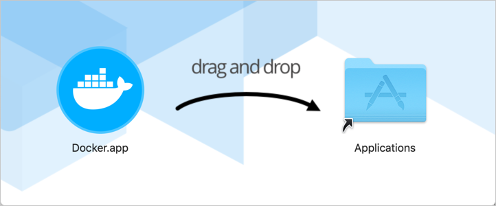
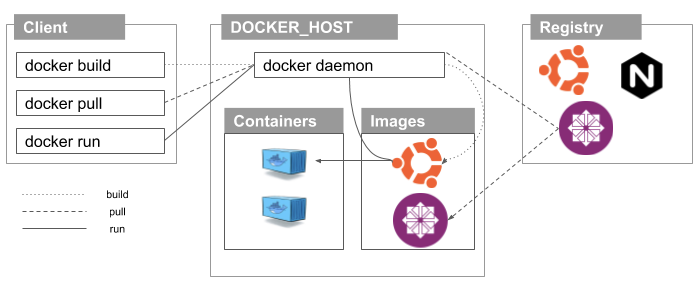

# Docker 소개

## 가상화의 역사

이전에는 서비스 배포 프로세스가 느리고 고통스러운 작업이었습니다.

1. 개발자가 코드를 작성
2. 운영팀이 Bare-metal 머신에 코드가 작동할 수 있도록 라이브러리 버전, Patch 및 Compiler를 설치
3. 버그나 오류가 있는 경우 프로세스가 다시 시작되고 개발자가 이를 수정한 후 운영팀이 다시 배포

하이퍼바이저의 등장으로 이런 부분들이 개선되었지만, 하이퍼바어지는 동일한 호스트에 여러 개의 가상 머신이 존재하며 실행 중이거나 Shutdown 되어 있을 수 있습니다. 가상 머신은 코드 배포 및 버그 수정 대기 시간을 크게 줄였지만 실제 게임 체인저는 Docker 컨테이너였습니다.

## 가상 머신과 컨테이너란 무엇인가?

가상 머신과 컨테이너는 서로 비슷한 목적을 가지고 있습니다. 가상 머신은 여러 게스트\(Guest\) 운영체제가 하이퍼바이저\(Hypervisor\)를 통해 에뮬레이션 됩니다. 컨테이너는 커널을 공유하여 여러 가상 환경을 에뮬레이션 합니다. 즉, 어플리케이션과 의존성\(Dependencies\)들을 독립된 단위로 묶고 격리시켜 어떤 환경 에서든 실행 가능하게 하는 것입니다. 이렇게 둘은 비슷한 역할을 수행하지만 둘간의 차이가 존재합니다.

### 가상 머신\(Virtual Machines\)

가상 머신은 컴퓨터 에뮬레이터이며 실제 컴퓨터 처럼 프로그램들을 실행 합니다. 가상 머신은 하이퍼바이를 통해 물리적인 하드웨어 위에서 동작합니다.하이퍼바이저는 물리적인 컴퓨터 하드웨어 위에서 동작합니다.

가상 머신\(VM\)은 컴퓨터 시스템의 에뮬레이션입니다. 하나의 하드웨어에서 VM을 이용하여 많은 개별 컴퓨터로 보이게 실행 할 수 있습니다.

각 VM은 공유한 OS가 필요하며 하드웨어가 가상화 됩니다. 하이퍼 바이저는 하드웨어와 VM 사이에 있으며 서버를 가상화 하는데 필요합니다.

VM이 시장에서 활용되는 이유는 비용을 절감하고 효율성을 높이기 위해서 입니다. 그러나 VM은 많은 시스템 리소스를 차지 할 수 있습니다. 각 VM은 운영 체제의 전체 자원뿐만 아니라 운영 체제가 실행해야 하는 모든 하드웨어의 가상 자원을 실행 합니다. 이것은 많은 RAM과 CPU를 사용하게 됩니다. 물리적인 하드웨어에서 실행하는 것과 비교시 여전히 경제적이지만 일부 어플리케이션의 경우 과도하게 사용될 가능성이 존재합니다.

### 컨테이너 \(Container\)

컨테이너를 사용하면 VM과 같이 컴퓨터를 가상화하는 대신 OS만 가상화 됩니다.  
컨테이너는 물리적 서버와 호스트 OS\(일반적으로 Linux 또는 Windows\) 위에 존재 합니다. 각 컨테이너는 호스트 OS 커널, 바이너리 그리고 라이브러리도 읽기 전용으로 공유 합니다. 라이브러리와 같은 OS 리소스를 공유하면 운영 체제 코드를 재현해야 할 필요성이 크게 줄어들기 때문에 단일 OS위에 여러 어플리케이션을 실행 할 수 있습니다. 따라서 컨테이너는 매우 가볍고 크기는 메가 바이트에 불과하며 구동하는데 몇 초 밖에 걸리지 않습니다. VM의 경우는 실행하는데 몇 분이 걸리며 크기도 컨테이너보다 수십 배 더 큽니다.

VM과 달리 컨테이너는 운영 체제, 프로그램 및 라이브러리, 특정 프로그램을 실행하기 위한 시스템 리소스로 구성되어 있습니다. 이것이 실제로 의미하는 것은 VM을 사용할 때 보다 컨테이너가 있는 단일 서버에 어플리케이션을 2배에서 3배까지 더 넣을 수 있다는 점입니다. 또한 컨테이너를 사용하여 개발, 테스트 및 배포를 위한 일관된 운영 환경을 만들 수 있습니다.

컨테이너는 두가지의 종류가 있습니다.

* Linux 컨테이너\(LXC\) - Linux 컨테이너 기술은 일반적으로 LXC로 알려져 있습니다. LXC는 단일 호스트에서 여러 개의 격리된 Linux 시스템을 실행하기 위한 Linux 운영 체제 레벨의 가상화 방법입니다.
* Docker - Docker는 LXC 컨테이너를 빌드하는 프로젝트로 시작하여 컨테이너를 보다 이식 가능하고 유연하게 사용할 수 있도록 LXC에 몇가지 변경 사항을 도입하였고 향후 자체 컨테이너 런타임 환경으로 변형되었습니다. Docker는 컨테이너를 효율적으로 생성, 배포 및 실행 할 수 있는 Linux 유틸리티입니다.

### VM과 컨테이너

컨테이너와 VM 모두 장/단점을 지니고 있습니다.

* VM은 서버에서 여러 어플리케이션을 실행하거나 관리해야 할 다양한 운영체제가 필요한 경우에 적합 합니다.
* 최소한의 서버에서 실행되는 어플리케이션 수를 최대화 할 경우에는 컨테이너가 적합 합니다.

_**\#VM과 컨테이너의 차이점**_

| **VM** | **컨테이너** |
| :--- | :--- |
| 헤비급 선수 | 라이트급 선수 |
| 제한된 성능 | 기본 성능 |
| 각 VM은 자체 OS에서 실행 | 모든 컨테이너는 호스트 OS를 공유 |
| 하드웨어 수준의 가상화 | OS 가상화 |
| 시작 시간 \(분\) | 시작 시간 \(초\) |
| 필요한 메모리 할당 | 적은 메모리 필요 |
| 완전히 격리되어 안전함 | 프로세스 수준의 격리 |

현재 가상화 기술 상태에서는 VM의 유연성과 컨테이너의 최소 리소스 요구 사항이 함께 작용하여 최대 기능을 제공합니다.

## 왜 컨테이너를 사용하나요?

컨테이너는 실제 실행 환경에서 어플리케이션을 추상화 할 수 있는 논리적인 패키징 메커니즘을 제공합니다. 이를 통해 개인 PC, 퍼블릭 클라우드, 데이터 센터에 관계 없이 컨테이너 기반 어플리케이션을 쉽고 일관되게 배포 할 수 있습니다. 개발자는 어디에서나 실행 할 수 있는 예측 가능한 환경을 만들 수 있습니다.

운영 관점에서 볼 때 리소스를 보다 세밀하게 제어하여 인프라의 효율성을 향상 시킬 수 있고 이는 컴퓨팅 리소스의 활용도를 높일 수 있습니다.

이러한 이점으로 인해 컨테이너\(e.g. Docker\)가 널리 채택되었습니다. Google, Facebook, Netflix 및 Salesforce와 같은 회사는 컨테이너를 활용하여 대규모 엔지니어링 팀의 생산성을 높이고 컴퓨팅 리소스의 활용도를 향상 시킵니다.

## Docker란 무엇인가?

위의 그림은 Docker의 정식 로고이며 고래가 컨테이너를 실고 항해하는 모습입니다. 이 글을 읽는 당신이 IT 분야에서 일을 하는 사람이라면 Docker에 대해서 들어보았을 것입니다. 어플리케이션을 포장해서 옮기고 컨테이너\(Container\)안에서 실행할 수 있게 해주는 것이 Docker입니다.

위키피디아에서는 Docker를 다음과 같이 정의 합니다.

> **도커 컨테이너는 소프트웨어의 실행에 필요한 모든 것을 포함하는 완전한 파일 시스템 안에 감싼다. 여기에는 코드, 런타임, 시스템 도구, 시스템 라이브러리 등 서버에 설치되는 무엇이든 아우른다. 이는 실행 중인 환경에 관계 없이 언제나 동일하게 실행 될 것을 보증한다.**  
> [**https://ko.wikipedia.org/wiki/%EB%8F%84%EC%BB%A4\_\(%EC%86%8C%ED%94%84%ED%8A%B8%EC%9B%A8%EC%96%B4**](https://ko.wikipedia.org/wiki/%EB%8F%84%EC%BB%A4_%28%EC%86%8C%ED%94%84%ED%8A%B8%EC%9B%A8%EC%96%B4%29)

즉, Docker는 컨테이너를 사용하여 어플리케이션을 보다 쉽게 생성, 배포 및 실행 할 수 있도록 설계된 도구 입니다. 컨테이너를 사용하면 개발자는 라이브러리 및 기타 종속성등을 하나의 패키지로 만들어 제공할 수 있습니다. 이렇게 하면 컨테이너 덕분에 개발자는 코드 작성 및 테스트에 사용 된 환경에서 설정에 관계 없이 다른 시스템에서 어플리케이션을 실행 할 수 있습니다.

Docker는 오픈 소스입니다. 즉, 누구나 사용할 수 있고 추가 기능이 필요한 경우에는 누구나 Docker에 기여할 수 있습니다.

### Docker는 누구를 위한 것인가?

Docker는 개발자와 시스템 관리자 모두에게 도움이 되도록 설계된 도구이고 DevOps \(개발 + 운영\) 도구 체인의 일부입니다. 개발자는 운영 환경에 대해 걱정하지 않고 코드 작성에 집중할 수 있습니다. 또한 Docker 컨테이너에서 이미 실행되도록 설계된 수천 개의 프로그램 중 하나를 어플리케이션의 일부로 사용할 수 있습니다. Docker는 시스템 관리자에게 유연성을 제공하고 설치 공간이 작고 오버 헤드가 적기 때문에 필요한 시스템 수를 줄일 수 있습니다.

### Docker를 이용해 무엇을 하나요?

아래의 시나리오를 생각해봅시다.

1. 개발자가 로컬에 코드를 작성하고 Docker 컨테이너를 사용하여 동료와 작업을 공유합니다.
2. Docker를 사용하여 어플리케이션을 테스트 환경으로 push하고 자동 혹은 수동 테스트를 진행합니다.
3. 개발자가 버그를 발견하면 개발 환경에서 버그를 수정하고 검증을 위해 테스트 환경에 재배포 할 수 있습니다.
4. 테스트가 완료되면 업데이트 된 이미지를 운영 환경으로 push 해서 문제를 해결합니다.

Docker 컨테이너는 개발자의 로컬 PC, 데이터 센터의 물리/가상 시스템, 클라우드 공급자의 환경등 여러 곳에서 실행될 수 있습니다.

Docker는 가볍고 빠릅니다. 하이퍼바이저 기반 VM대신 실행 가능하고 비용 효율적인 대안을 제공하기에 더 많은 컴퓨팅 리소스를 사용하여 비즈니스 목표를 달성 할 수 있습니다. Docker는 고밀도 환경과 적은 리소스로 더 많은 작업을 수행해야 하는 환경에 적합합니다.

## Docker를 채택한 회사

Enterprise급 조직에서는 Docker를 여러 방식으로 사용하고 있습니다.

### GE

GE의 어플리케이션 개발 프로세스는 수동이며 휴먼 에러등을 감안할 때 개발에서 프로덕션으로 이동하는데 평균 6주의 시간이 소모되었습니다.

이 문제는 Docker를 채택하여 한번만 빌드하고 모든 환경에서 실행할 수 있는 기능을 제공함으로써 해결되었습니다.

Docker 도입전에는 VM에서 하나의 어플리케이션을 실행 할 수 있는 VMware를 사용했지만 Docker를 사용하게 된 후 컨테이너당 평균 14개의 어플리케이션을 실행 할 수 있었습니다.

### PayPal

PayPal은 Docker의 상용 솔루션을 사용합니다. 이를 통해 개발자 및 인프라팀은 생산성 및 민첩성 그리고 비용 효율성에서 효과를 가져왔습니다.

### BBC News

BBS News는 매일 80000개가 넘는 온라인 뉴스를 제공합니다. 서로 다른 환경에서 26000개 이상의 작업을 순차적으로 실행하기에 작업 당 약 60분의 대기 시간이 존재했습니다.

Docker는 작업이 병렬로 실행되도록 함으로써 BBC의 시간 지연 문제를 해결했습니다. 속도와 볼륨의 근본적인 문제가 해결되었기에 개발자에게 유연성을 제공하게 되었고 지속적인 통합으로 보다 효율적이고 빠른 개발 환경 제공이 가능해졌습니다.

## 일반적인 Docker 활용 사례

### 구성 단순화

Docker는 하나의 Configuration으로 모든 플랫폼에서 실행할 수 있습니다. Configuration 파일을 코드에 넣고 환경 변수를 전달하여 다른 환경에 맞출 수 있습니다. 따라서 하나의 Docker 이미지를 다른 환경에서 사용할 수 있습니다.

### 코드 관리

Docker는 일관된 환경을 제공하여 개발 및 코딩을 훨씬 편안하게 만들어줍니다. Docker 이미지는 변경이 불가하기에 개발환경에서 운영 환경까지 어플리케이션 환경이 변경되지 않는 이점이 존재합니다.

### 개발 생산성 향상

개발 환경을 운영 환경에 최대한 가깝게 복제할 수 있습니다. Docker를 사용하면 코드가 운영 환경의 컨테이너에서 실행될 수 있으며 VM과 달리 Docker는 오버 헤드 메모리 용량이 적기에 여러 서비스를 실행하는데 도움이 됩니다.

또한 Docker의 Shared Volume을 사용하여 호스트에서 컨테이너의 어플리케이션 코드를 사용할 수 있도록 할 수 있습니다. 이를 통해 개발자는 자신의 플랫폼 및 편집기에서 소스 코드를 편집할 수 있으며 이는 Docker내에서 실행중인 환경에 반영됩니다.

### 어플리케이션 격리

Web Server\(e.g. Apache, Nginx\)와 연결된 API 서버를 격리할 필요가 있는 경우가 있습니다. 이 경우 다른 컨테이너에서 API를 서버를 실행 할 수 있습니다.

### 빠른 배포

컨테이너가 OS를 부팅하지 않고 어플리케이션을 실행하기 때문에 Docker 컨테이너를 매우 빠르게 만들 수 있습니다.

## Docker 아키텍처

아래의 그림은 Docker 아키텍처를 간단히 표현한 것입니다.

### 도커 엔진

Docker 시스템의 핵심입니다. Docker Engine은 클라이언트-서버 아키텍처를 따르는 어플리케이션이고 호스트 시스템에 설치됩니다. Docker Engine에는 세 가지 구성 요소가 존재합니다.

* 서버: dockerd라는 docker 데몬입니다. Docker 이미지를 만들고 관리 할 수 있습니다.
* REST API: Docker 데몬에게 무엇을 할지 지시하는 용도로 사용됩니다.
* CLI \(Command Line Interface\): Docker 명령을 입력하는데 사용되는 클라이언트입니다.

### Docker 클라이언트

Docker 사용자는 클라이언트를 통해 Docker와 상호 작용할 수 있습니다. docker 명령이 실행될 때 클라이언트는 이를 dockerd 데몬으로 보내어 실행합니다. Docker API는 Docker 명령에서 사용됩니다. Docker 클라이언트는 둘 이상의 데몬과 통신 할 수 있습니다.

### Docker 레지스트리

Docker 이미지가 저장된 위치입니다. docker pull 또는 docker run 명령을 실행하면 필요한 Docker 이미지가 구성된 레지스트리에서 가져옵니다. docker push 명령을 실행하면 docker 이미지가 구성된 레지스트리에 저장됩니다.

### Docker 객체

Docker로 작업할 때는 이미지, 컨테이너, 볼륨, 네트워크를 사용합니다. 이것들을 모두 Docker 객체라고 표현합니다.

#### 이미지

Docker 이미지는 Docker 컨테이너를 만드는 설명이 포함된 읽기 전용 템플릿입니다. Docker 이미지는 Docker Hub에서 가져와서 사용하거나 기본 이미지에 추가 설명을 추가하고 새롭게 수정된 Docker 이미지를 만들 수 있습니다. dockerfile을 사용하여 고유한 Docker 이미지를 만들 수도 있습니다. 컨테이너를 실행하기 위한 모든 지시 사항을 dockerfile에 작성하면 됩니다.

#### 컨테이너

Docker 이미지를 실행하면 Docker 컨테이너가 생성됩니다. 모든 어플리케이션 및 환경은 해당 컨테이너내에서 실행됩니다. Docker API 또는 CLI를 사용하여 Docker 컨테이너를 시작, 중지, 삭제할 수 있습니다.

#### 볼륨

Docker가 생성하고 Docker 컨테이너가 사용하는 영속적인 데이터는 볼륨에 저장됩니다. 이것은 docker CLI 또는 API를 통해 관리됩니다. 컨테이너에 쓰기 가능한 데이터를 유지해야 한다면 항상 볼륨을 사용하는 것이 좋습니다.

#### 네트워크

Docker 네트워킹은 모든 격리된 컨테이너가 통신하는 통로입니다. Docker에는 5개의 네트워크 드라이버가 있습니다.

1. Bridge: 컨테이너의 기본 네트워크 드라이버입니다. 어플리케이션이 독립형 컨테이너 \(e.g. 동일한 Docker 호스트와 통신하는 컨테이너\)에서 실행될 때에 이 네트워크를 사용합니다.
2. Host: Docker 컨테이너와 Docker 호스트간의 네트워크 격리를 제거합니다. 호스트와 컨테이너 사이에 네트워크 격리가 필요하지 않을 경우에 사용됩니다.
3. Overlay: 컨테이너가 다른 Docker 호스트에서 실행 중이거나 Swarm 서비스가 여러 어플리케이션에 의해 형성될 경우에 사용됩니다.
4. None: 모든 네트워킹을 비활성화 합니다.
5. macvlan: 물리적 주소처럼 보이도록 하기위해 mac 주소를 컨테이너에 할당합니다. 네트워크 트래픽은 컨테이너간 mac 주소를 통해 라우팅 됩니다. 이 네트워크는 VM 설정을 마이그레이션 하는 동안 컨테이너를 물리적 장치처럼 보이게 하려는 경우에 사용됩니다.

