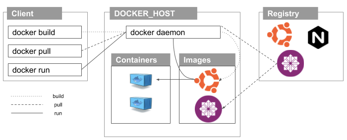

# Docker 아키텍처

아래의 그림은 Docker 아키텍처를 간단히 표현한 것입니다.

### 도커 엔진

Docker 시스템의 핵심입니다. Docker Engine은 클라이언트-서버 아키텍처를 따르는 어플리케이션이고 호스트 시스템에 설치됩니다. Docker Engine에는 세 가지 구성 요소가 존재합니다.

* 서버: dockerd라는 docker 데몬입니다. Docker 이미지를 만들고 관리 할 수 있습니다.
* REST API: Docker 데몬에게 무엇을 할지 지시하는 용도로 사용됩니다.
* CLI \(Command Line Interface\): Docker 명령을 입력하는데 사용되는 클라이언트입니다.

### Docker 클라이언트

Docker 사용자는 클라이언트를 통해 Docker와 상호 작용할 수 있습니다. docker 명령이 실행될 때 클라이언트는 이를 dockerd 데몬으로 보내어 실행합니다. Docker API는 Docker 명령에서 사용됩니다. Docker 클라이언트는 둘 이상의 데몬과 통신 할 수 있습니다.

### Docker 레지스트리

Docker 이미지가 저장된 위치입니다. docker pull 또는 docker run 명령을 실행하면 필요한 Docker 이미지가 구성된 레지스트리에서 가져옵니다. docker push 명령을 실행하면 docker 이미지가 구성된 레지스트리에 저장됩니다.

### Docker 객체

Docker로 작업할 때는 이미지, 컨테이너, 볼륨, 네트워크를 사용합니다. 이것들을 모두 Docker 객체라고 표현합니다.

#### 이미지

Docker 이미지는 Docker 컨테이너를 만드는 설명이 포함된 읽기 전용 템플릿입니다. Docker 이미지는 Docker Hub에서 가져와서 사용하거나 기본 이미지에 추가 설명을 추가하고 새롭게 수정된 Docker 이미지를 만들 수 있습니다. dockerfile을 사용하여 고유한 Docker 이미지를 만들 수도 있습니다. 컨테이너를 실행하기 위한 모든 지시 사항을 dockerfile에 작성하면 됩니다.

#### 컨테이너

Docker 이미지를 실행하면 Docker 컨테이너가 생성됩니다. 모든 어플리케이션 및 환경은 해당 컨테이너내에서 실행됩니다. Docker API 또는 CLI를 사용하여 Docker 컨테이너를 시작, 중지, 삭제할 수 있습니다.

#### 볼륨

Docker가 생성하고 Docker 컨테이너가 사용하는 영속적인 데이터는 볼륨에 저장됩니다. 이것은 docker CLI 또는 API를 통해 관리됩니다. 컨테이너에 쓰기 가능한 데이터를 유지해야 한다면 항상 볼륨을 사용하는 것이 좋습니다.

#### 네트워크

Docker 네트워킹은 모든 격리된 컨테이너가 통신하는 통로입니다. Docker에는 5개의 네트워크 드라이버가 있습니다.

1. Bridge: 컨테이너의 기본 네트워크 드라이버입니다. 어플리케이션이 독립형 컨테이너 \(e.g. 동일한 Docker 호스트와 통신하는 컨테이너\)에서 실행될 때에 이 네트워크를 사용합니다.
2. Host: Docker 컨테이너와 Docker 호스트간의 네트워크 격리를 제거합니다. 호스트와 컨테이너 사이에 네트워크 격리가 필요하지 않을 경우에 사용됩니다.
3. Overlay: 컨테이너가 다른 Docker 호스트에서 실행 중이거나 Swarm 서비스가 여러 어플리케이션에 의해 형성될 경우에 사용됩니다.
4. None: 모든 네트워킹을 비활성화 합니다.
5. macvlan: 물리적 주소처럼 보이도록 하기위해 mac 주소를 컨테이너에 할당합니다. 네트워크 트래픽은 컨테이너간 mac 주소를 통해 라우팅 됩니다. 이 네트워크는 VM 설정을 마이그레이션 하는 동안 컨테이너를 물리적 장치처럼 보이게 하려는 경우에 사용됩니다.

