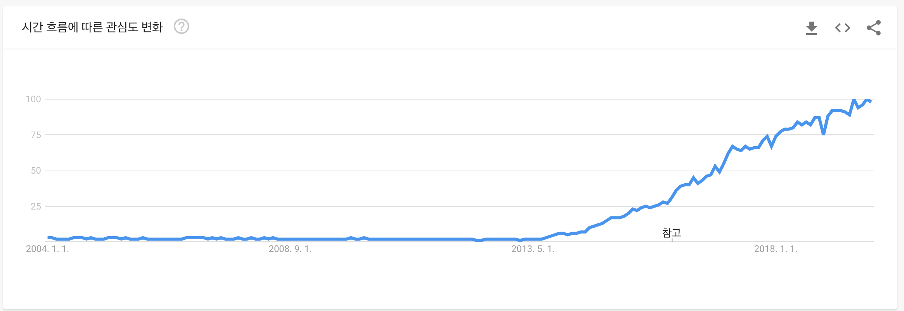

# 2.3 왜 컨테이너를 사용하나요?

컨테이너는 실제 실행 환경에서 어플리케이션을 추상화 할 수 있는 논리적인 패키징 메커니즘을 제공합니다. 이를 통해 개인 PC, 퍼블릭 클라우드, 데이터 센터에 관계 없이 컨테이너 기반 어플리케이션을 쉽고 일관되게 배포 할 수 있습니다. 개발자는 어디에서나 실행 할 수 있는 예측 가능한 환경을 만들 수 있습니다.

운영 관점에서 볼 때 리소스를 보다 세밀하게 제어하여 인프라의 효율성을 향상 시킬 수 있고 이는 컴퓨팅 리소스의 활용도를 높일 수 있습니다.

이러한 이점으로 인해 컨테이너\(e.g. Docker\)가 널리 채택되었습니다. Google, Facebook, Netflix 및 Salesforce와 같은 회사는 컨테이너를 활용하여 대규모 엔지니어링 팀의 생산성을 높이고 컴퓨팅 리소스의 활용도를 향상 시킵니다.

